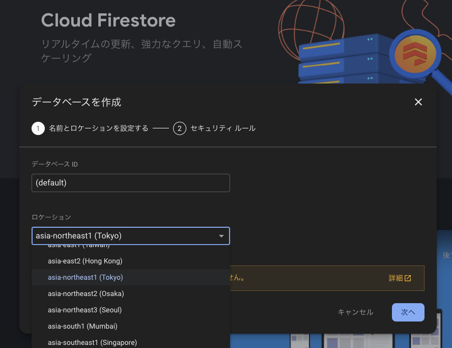

# EasyApiHub デプロイ(アップロード) の方法
cluster の外部通信のためのAPIサーバーを簡単に作成できるプロジェクトです。  

# 概要
Google アカウントさえあれば cluster の外部通信のためのAPIサーバーを簡単に作成できるようにするためのプロジェクトです。  
基本機能として 値の保存, 取得, を提供します。他のAPIへの接続も簡単にできる仕組みを提供します。  

# 必要な知識
- ターミナルの基本操作
- Google アカウント

# デプロイ(アップロード) の方法
まずは Firebase console でプロジェクトを作成し、Firebase の設定を行います。
その後 Firebase CLI で Firebase のデプロイを行います。  

## Firebase console の設定
1. Google アカウントで Firebase console 画面にログイン
https://console.firebase.google.com/  
2. プロジェクトを作成   
プロジェクト名 EasyApiHub  


3. プロジェクトの設定 プラン変更 左メニュー下の `アップグレード` をクリック  
- 従量制 Blaze プラン を選択  
- JPY の予算額 1000円 で設定  


4. Firestore の設定  
左メニュー 構築 > Firestore データベース > 作成 を選択  
- ロケーションを asia-northeast1 に設定  
- モードを本番モードに設定  



6. Authentication の設定
左メニュー 構築 > Authentication > 始める を選択  
- 追加のプロバイダ で Google を有効にする
- サポートメールを設定する  


5. firebaseConfig の 取得
左メニュー プロジェクトの設定 > 全般 > マイアプリ > アプリの追加 > Web を選択  
- アプリのニックネームを入力 WebApp  
- Firebase Hosting は無効にする  
- Firebase SDK の設定をコピーする  
- SDK の設定と構成の `firebaseConfig` の値を `firebase/public/firebaseConfig.js` を作成して内容を貼り付ける
```
// firebaseConfig の 取得
// firebase console > project settings > web app > config

const firebaseConfig = {
  apiKey: "xxxxx",
  authDomain: "xxxxx.firebaseapp.com",
  projectId: "xxxx",
  storageBucket: "xxxxx.firebasestorage.app",
  messagingSenderId: "xxxxxx",
  appId: "1:xxxx:web:xxxxxx"
};

export default firebaseConfig;
```

## Firebase CLI のインストール
ここからは ターミナルでの操作です。 例は mac の場合となります。  
ターミナルを起動してください。   
1. ターミナルを起動する  
アプリケーション > ユーティリティ > ターミナル を選択してください。  
  

2. npm の環境を整える(例は mac の場合)  
https://github.com/nodenv/nodenv  
```:bash
brew install nodenv
nodenv update
nodenv init  
nodenv install -L
nodenv global 18.20.3
```

3. Firebase CLI のインストール  
https://firebase.google.com/docs/cli?hl=ja  
```:bash
npm install -g firebase-tools
```

4. Firebase CLI のログインとプロジェクト一覧の確認  
`firebase login` を ブラウザで Google ログイン画面が表示されるのでログインする。  
```:bash
# ログイン
firebase login
# firebase login:list
# firebase login:use xxxxx@gmail.com
```

## プロジェクトのデプロイ
Github のプロジェクをダウンロードして firebase にデプロイ(アップロード) します。  
```:bash
# プロジェクトのダウンロード
git clone git@github.com:tfuru/EasyApiHub.git
cd EasyApiHub/firebase

# プロジェクト一覧の確認と選択
firebase projects:list
firebase use easyapihub

# プロジェクトのデプロイ
cd firebase
firebase deploy
```

