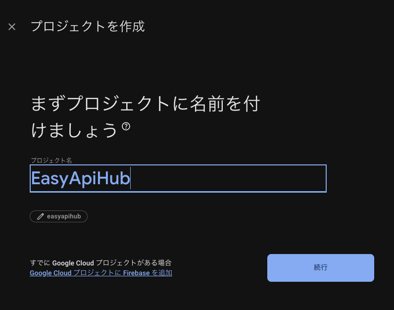
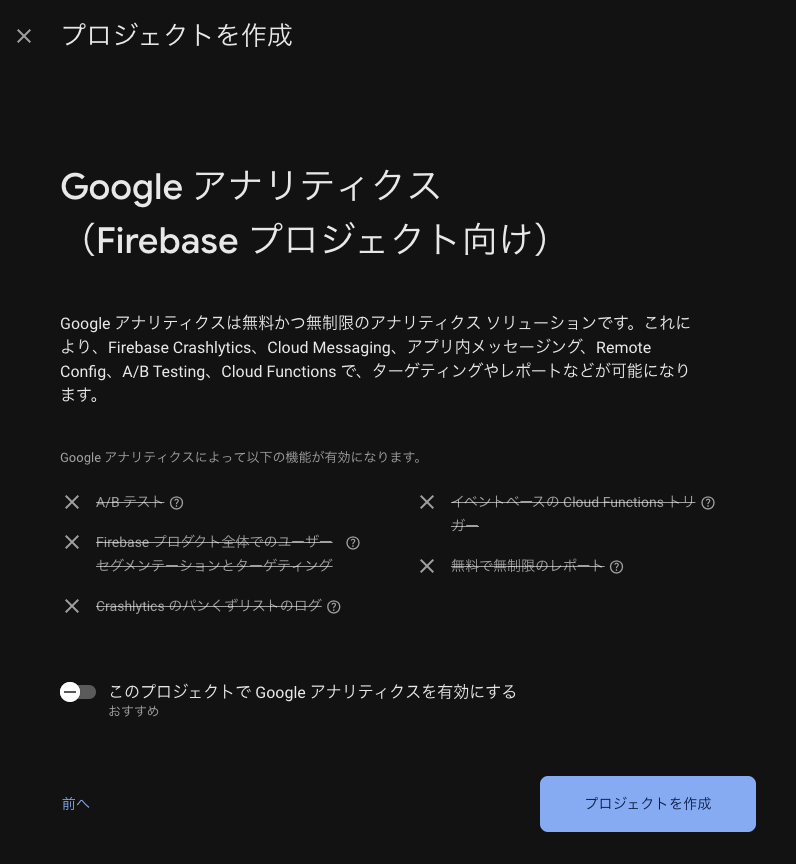
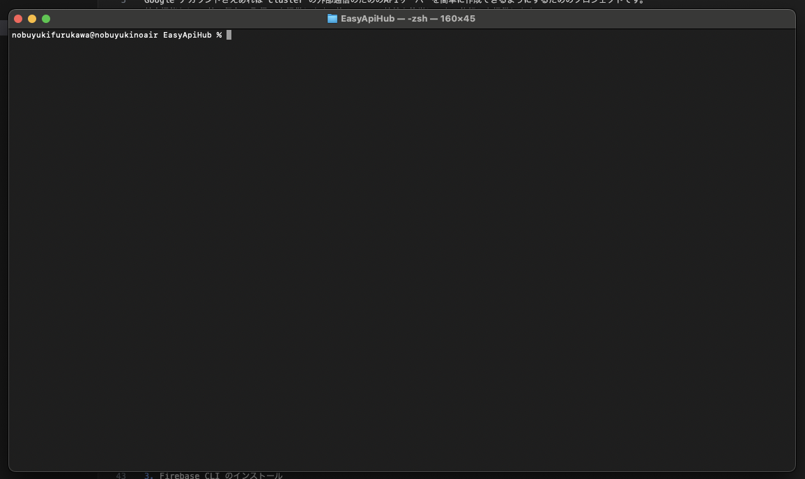

# EasyApiHub
cluster の外部通信のためのAPIサーバーを簡単に作成できるプロジェクトです。  

# 概要
Google アカウントさえあれば cluster の外部通信のためのAPIサーバーを簡単に作成できるようにするためのプロジェクトです。  
基本機能として 値の保存, 取得, を提供します。他のAPIへの接続も簡単にできる仕組みを提供します。  

# 必要な知識
- ターミナルの基本操作
- Google アカウント

# 使い方
まずは Firebase console でプロジェクトを作成し、Firebase の設定を行います。
その後 Firebase CLI で Firebase のデプロイを行います。  

## Firebase console の設定
1. Google アカウントで Firebase console 画面にログイン
https://console.firebase.google.com/  
2. プロジェクトを作成   
プロジェクト名 EasyApiHub  


3. プロジェクトの設定 プラン変更 右メニュー下の `アップグレード` をクリック  
- 従量制 Blaze プラン を選択  
- JPY の予算額 1000円 で設定  


## Firebase CLI のインストール
ここからは ターミナルでの操作です。 例は mac の場合となります。  
ターミナルを起動してください。   
1. ターミナルを起動する  
アプリケーション > ユーティリティ > ターミナル を選択してください。  
  

2. npm の環境を整える(例は mac の場合)  
https://github.com/nodenv/nodenv  
```:bash
brew install nodenv
nodenv update
nodenv init  
nodenv install -L
nodenv global 18.20.3
```

3. Firebase CLI のインストール  
https://firebase.google.com/docs/cli?hl=ja  
```:bash
npm install -g firebase-tools
```

4. Firebase CLI のログインとプロジェクト一覧の確認  
`firebase login` を ブラウザで Google ログイン画面が表示されるのでログインする。  
```:bash
# ログイン
firebase login
# firebase login:list
# firebase login:use xxxxx@gmail.com

# プロジェクト一覧の確認
firebase projects:list
```

## プロジェクトのデプロイ
Github のプロジェクをダウンロードして firebase にデプロイ(アップロード) します。  
```:bash
# プロジェクトのダウンロード
git clone git@github.com:tfuru/EasyApiHub.git
cd EasyApiHub

# プロジェクトのデプロイ
cd firebase
firebase deploy
```

